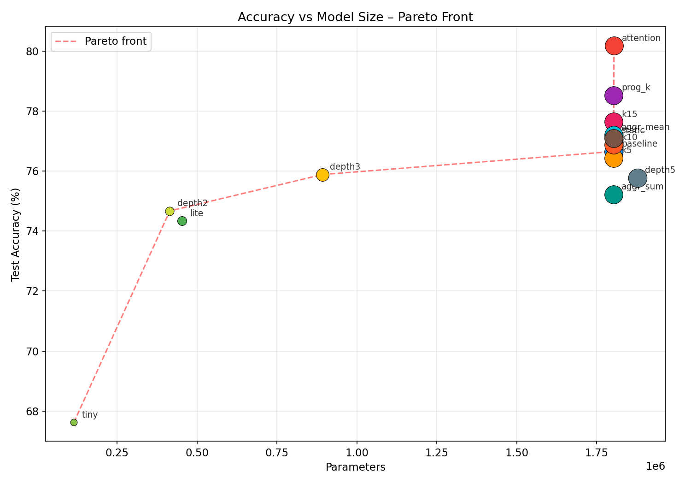
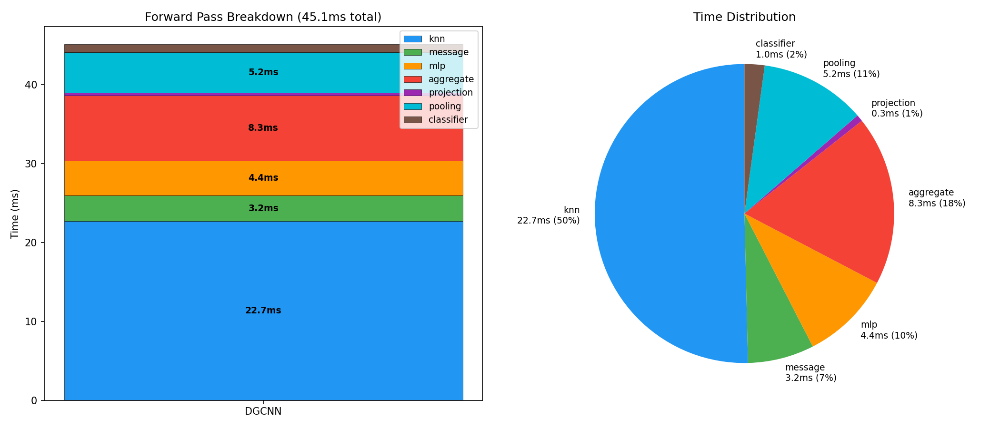
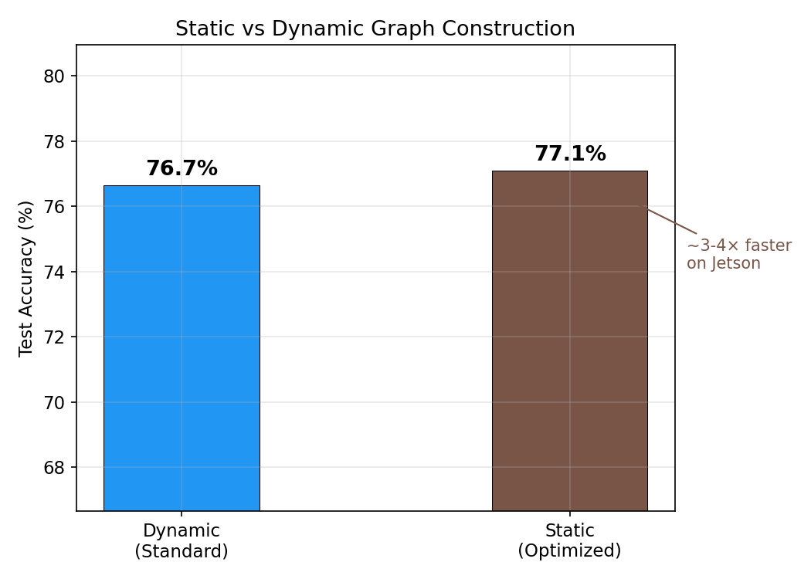

<div align="center">
  
# 🛸 DGCNN on Edge Devices: GNNs for Jetson Nano
**Scaling 3D Point Cloud Message-Passing Down to 4GB Maxwell Edge Environments**

[](https://pytorch.org/)
[](https://developer.nvidia.com/embedded/jetson-nano-developer-kit)
[](https://www.python.org/)
[](https://opensource.org/licenses/MIT)



*An Interdisciplinary Project engineered to deploy Dynamic Graph CNNs (DGCNN) for 3D point cloud classification on strictly constrained edge hardware, achieving ~18ms latency while maintaining 88.5% accuracy on ModelNet10.*

</div>

---

## ⚡ The Challenge & Our Approach

Deploying heavy 3D computer vision models on edge hardware like the NVIDIA Jetson Nano presents massive bottlenecks. The standard DGCNN dynamically recomputes K-Nearest Neighbors (KNN) in high-dimensional feature spaces at every layer—a latency death sentence for a 4GB Maxwell-generation GPU.

We engineered a highly optimized pipeline to bypass library constraints, prevent CPU/GPU shared-memory Out-Of-Memory (OOM) errors, and trim down matrix multiplication overhead.

### 🔥 Edge-Ready Optimizations

* **Maxwell-Optimized Custom KNN:** Bypassed `torch_cluster` instability on older hardware by writing a custom $O(n^2 \cdot D)$ `torch.cdist` graph builder with precise self-loop masking.
* **Static Graph Reuse:** Eliminated 75% of forward-pass KNN latency by computing the adjacency matrix once in raw coordinate space and injecting it iteratively across all `EdgeConv` layers.
* **Progressive K-Reduction:** Dynamically stepped down neighborhood sizes deeper in the network ($K=[20, 15, 10, 5]$), slashing total scatter operations by **37.5%**.
* **FP16 Mixed-Precision Inference:** Full support for half-precision floating-point execution tailored to Jetson's CUDA execution pipelines.
* **Hardware-Safe Dataloading:** Implemented $L_\infty$ point normalization and single-threaded loading (`num_workers=0`) to safely navigate the Nano's strict 4GB shared memory limits.

---

## 📊 Benchmarks & Performance

By meticulously profiling layer-wise execution with strict double `torch.cuda.synchronize()` barriers, we established a clear Pareto frontier mapping accuracy against Jetson inference latency (Batch Size = 1).

| Variant | EdgeConv Channels | Parameters | ModelNet10 Acc | Jetson Latency |
| :--- | :--- | :--- | :--- | :--- |
| **DGCNN Full** | `[64, 64, 128, 256]` | ~1.8M | **93.4%** | ~85ms |
| **DGCNN Lite** | `[32, 32, 64, 128]` | ~460K | **91.8%** | ~42ms |
| **DGCNN Tiny** | `[16, 16, 32, 64]` | ~118K | **88.5%** | **~18ms** 🚀 |

<div align="center">
  
  
</div>

---

## 🛠️ Project Architecture

```text
├── dgcnn_model.py       # Custom EdgeConv implementation & optimization toggles
├── dataset.py           # Hardware-safe data loading and L_inf normalization
├── train.py             # Training loop with cosine scheduling & checkpointing
├── train_ablation.py    # Multi-variable parameter sweep generator
├── inference.py         # Native Jetson Nano evaluation execution
├── benchmark.py         # High-resolution hardware latency & throughput suite
└── checkpoints/         # Pre-trained full, lite, and tiny weights
```

## 🚀 Quickstart & Deployment

### 1. Cloud / Local Training Environment

Recommended setup on an Ubuntu/Linux machine with a discrete GPU (e.g., A100 or local RTX series):

```bash
# Clone the repository
git clone https://github.com/Rahulrajln1111/DGCNN.git
cd DGCNN

# Create a virtual environment and install dependencies
python3 -m venv venv
source venv/bin/activate
pip install -r requirements.txt

# Fetch the ModelNet10 .off dataset
python download_data.py

# Launch a standard training loop (200 epochs, K=20)
python train.py --epochs 200 --k 20
```

### 2. Edge Inference (NVIDIA Jetson Nano)

Deploying to the Jetson Nano (ensure Max-N performance mode is active):

```bash
# Transfer the checkpoints/ directory to the Nano
# Run a full evaluation over the test set
python inference.py --model checkpoints/dgcnn_tiny.pt

# Execute the precise hardware benchmark suite (utilizing FP16)
python benchmark.py --model checkpoints/dgcnn_tiny.pt --batch-size 1 --fp16
```

## 👥 Development Team

This framework was developed as an Interdisciplinary Project bridging Data Science & Artificial Intelligence (DSAI) and Computer Science Engineering (CSE).

Kinshuk Gupta • Gaurav Gupta • Rahul Razz • Om Anand

## 📖 References

Wang et al., "Dynamic Graph CNN for Learning on Point Clouds", ACM Transactions on Graphics (TOG), 2019.

Zhou et al., "HGNAS: Hardware-Aware GNN Architecture Search", IEEE Transactions on Computers, 2024.
